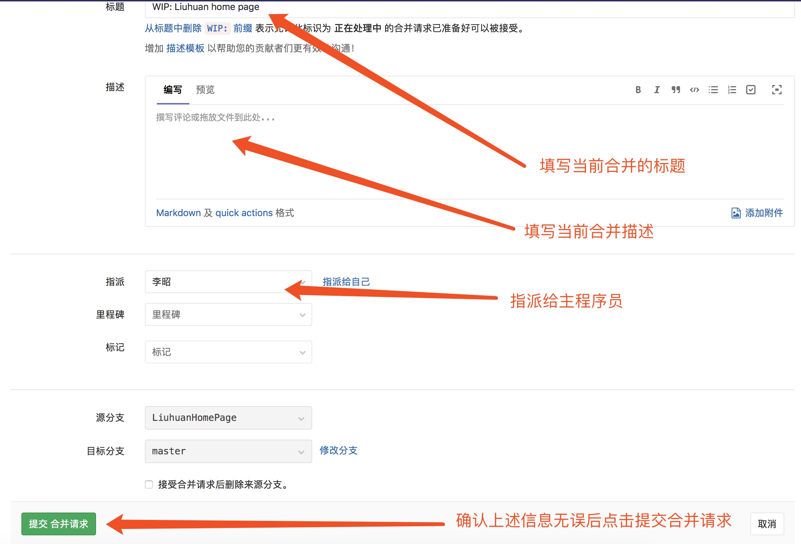

### 添加文件至待提交列表
>git add .;

### 提交至仓库
>git commit -m '说明';

### 推送至服务器当前分支
>git push;

### 推送至服务器指定分支（主分支）
>git push origin master;

### 查看当前仓库的所有分支
>git branch -a;

### 创建分支
>git branch 分支名称;

### 切换分支
>git checkout 分支名称;

### 创建并且切换分支
>git checkout -b 分支名称;

### 更新远程分支列表
> git remote update origin --prune

### 查看提交日志
> git log

### 版本回退
* Git必须知道当前版本是哪个版本，在Git中，用HEAD表示当前版本
* 使用git reset命令
* 上一个版本就是HEAD^,上上一个版本就是HEAD^^,当然往上100个版本,写成HEAD~100。
* git产生的版本号id(版本号没必要写全，前几位就可以了)
> git reset --hard HEAD^

或者

> git reset --hard <git 版本号>

### 查看你的git命令执行日志
> git reflog

分支开发使用命令简介

首先clone项目代码后

创建自己的分支
> git branch LiuhuanHomePage;

这里我们从master分支上创建了一个LiuhuanHomePage分支

切换至当前分支
> git checkout LiuhuanHomePage;

或者我们使用 
> git checkout -b LiuhuanHomePage 

创建并且切换至当前分支

如果GitLab上存在我们的开发分支那么我们直接使用
> git checkout LiuhuanHomePage;

切换至当前分支
## 开始功能开发。。。

代码文件添加
> git add .;

将修改提交至本地仓库
> git commit -m "当前提交时做了哪些修改，变更";

将当前代码推送至GitLab服务器
如果该分支第一次push至GitLab（此时GitLab没有当前分支，我们使用以下命令创建并且推送）
> git push --set-upstream origin LiuHuanHomePage;

PS:该命令只使用一次即可

之后提交时直接使用提交当前分支
> git push;

提交合并之前请将本地代码与服务器代码合并(rebase onto操作/merge操作)

PS：这里不能推送至主分支，开发人员只能推送自己的分支，主分支由主程序员维护

## 当前分支模块开发完毕
登录gitlab
#### 点击下图按钮

#### 完善合并请求信息

#### 等待主程序员合并代码
